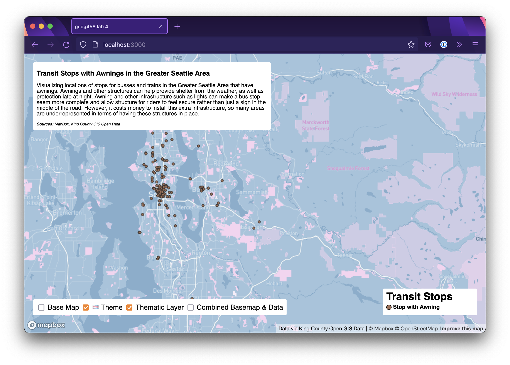
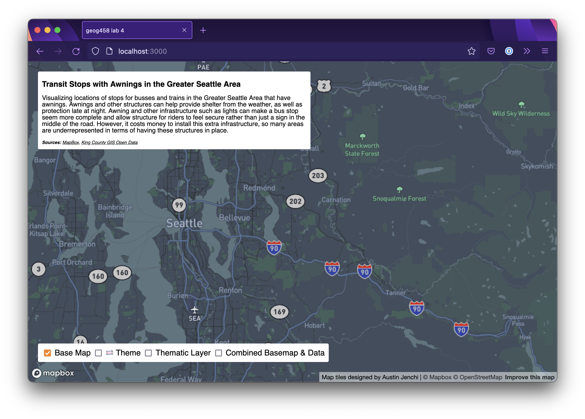
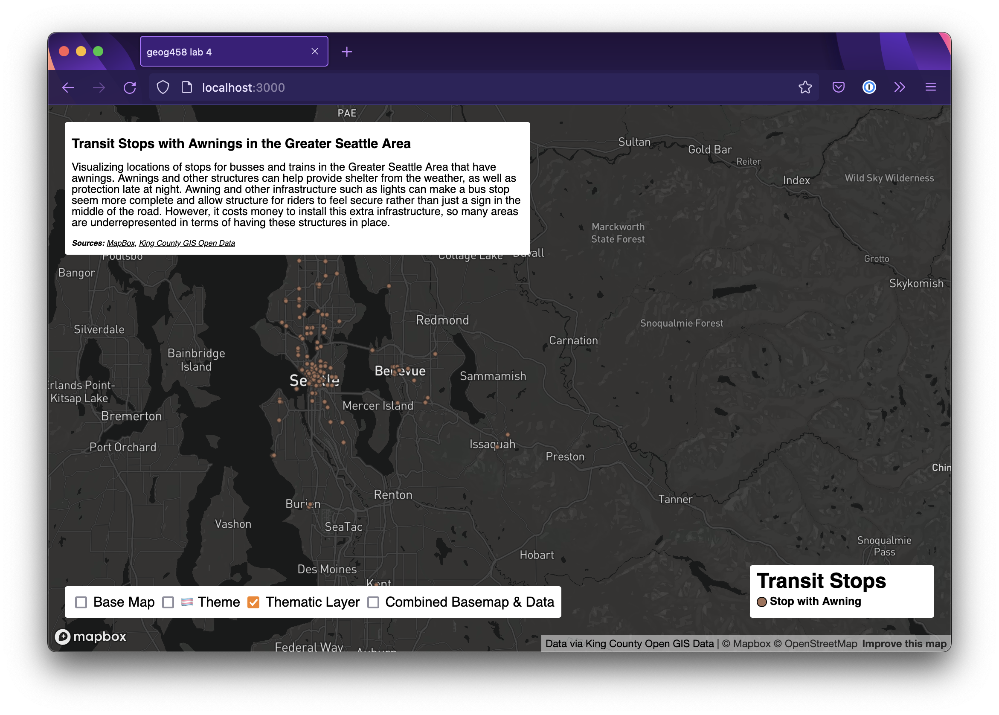
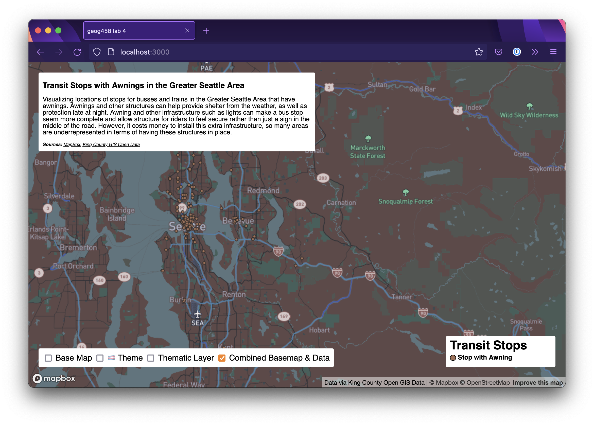
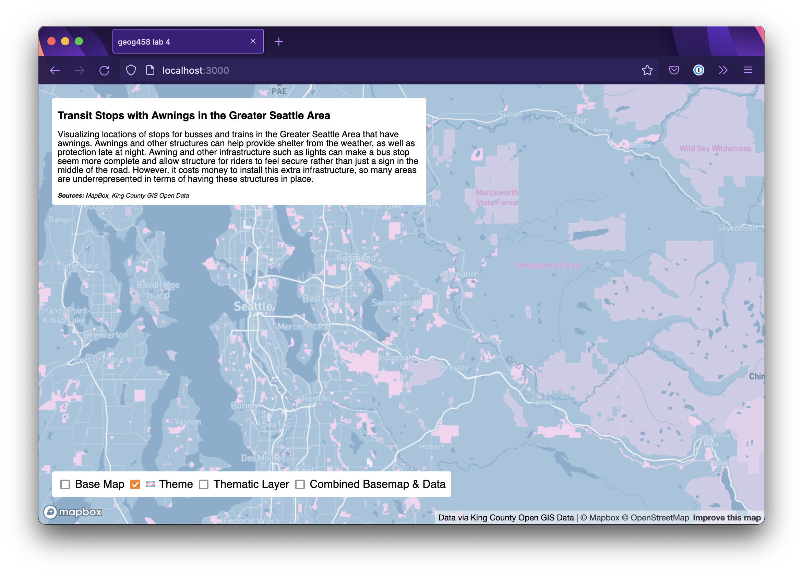

# geog458 lab 4

This map analyzes transit stops in the Greater Seattle Area with awnings. The Greater Seattle Area
has a transit system that is lauded for being relatively good. However, many areas throughout the
system are underrepresented in the quality of the actual stops, the points at which users interact
with the system. One indication of this infrastructure investment is the presence of an awning or
other cover to shelter occupants as they wait for their mode of transit. Awnings can also provide
for other quality of life improvements such as lighting. These can improve the quality of the
transit experience for riders, protect them from the elements, and ensure greater security.

https://timtim17.github.io/geog458-lab4/

## Tilesets

All tilesets are available from zoom level 7 to zoom level 16. This provides a good view, both in
broad and in detail, of the Greater Seattle and Puget Sound area.

**Basemap**

Basic colored map, with no data or thematic elements. I utilized a basic dark color scheme to allow
for any data layered on top to be emphasized.

**Thematic Layer:** Locations of transit stops with awnings.

Just data points representing each stop geographically, not on a map.

**Data &amp; Basemap:** Data layered on top of the basemap.

The thematic layer and basemap layers combined. Could be considered a complete map. Shows the data
in context on top of the colored basemap.

**🏳️‍⚧️ Trans Theme**: trans rights!

Colored style and theme for the basemap. Contains bright colors representing the trans flag, light
blue and pink.

